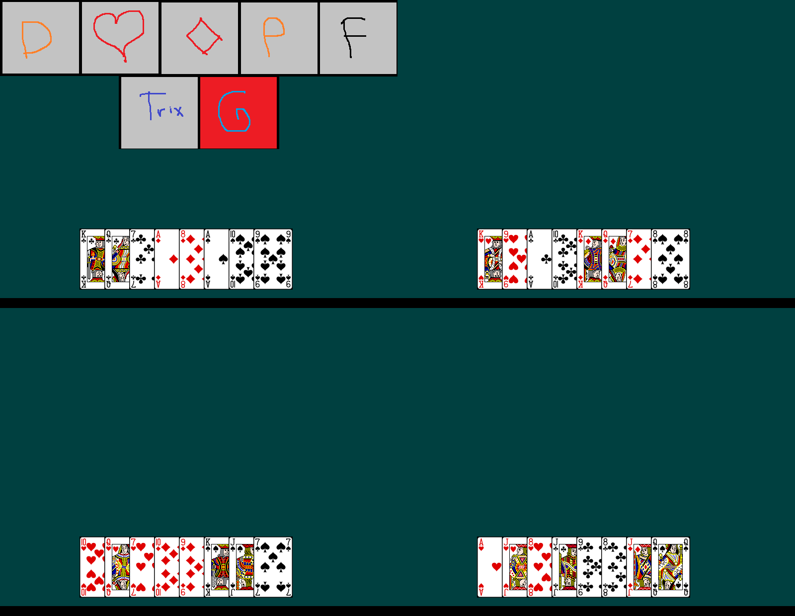
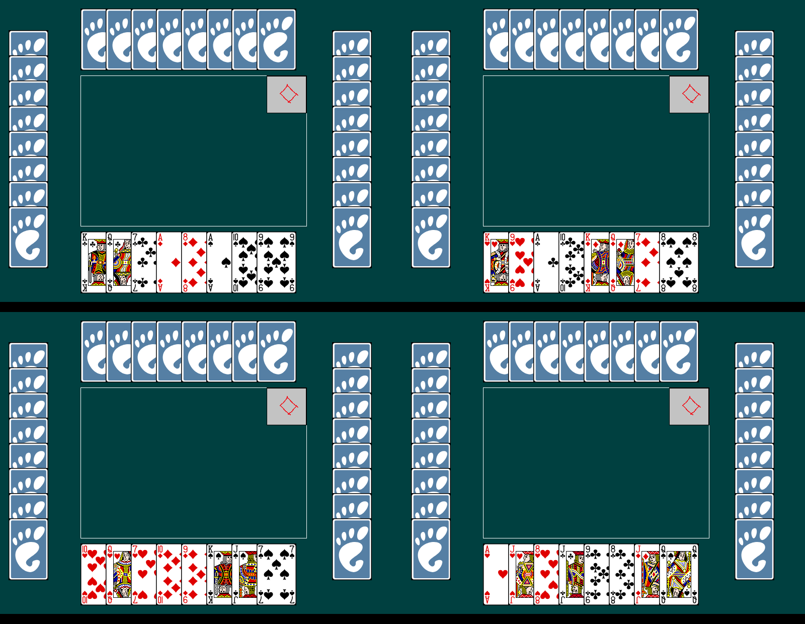
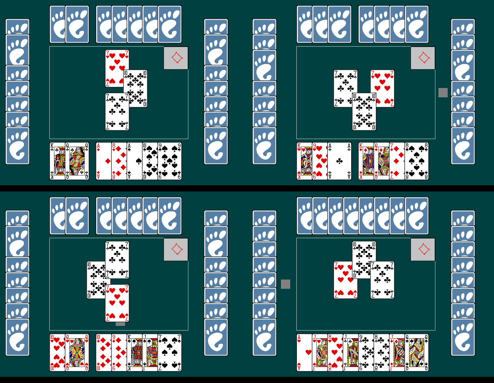
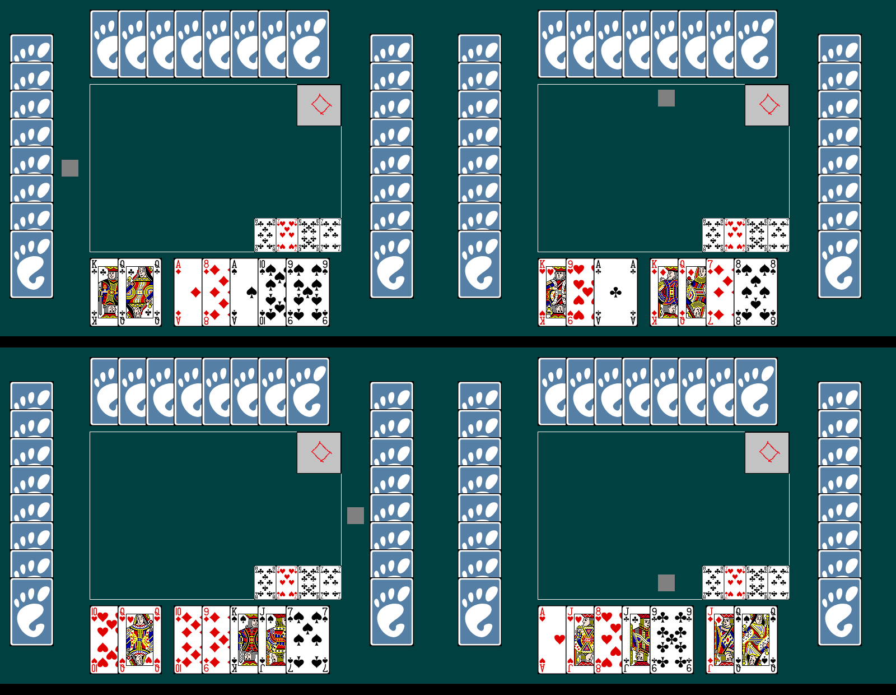
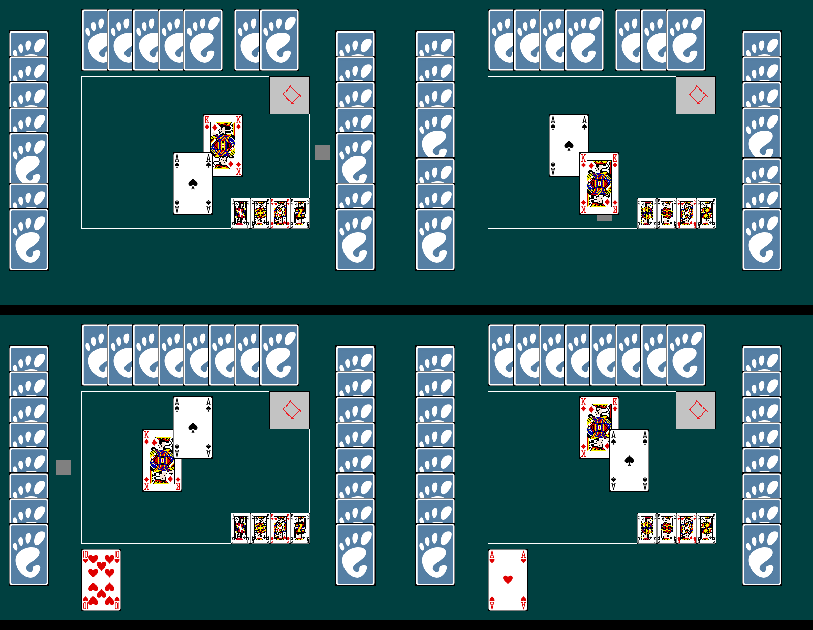
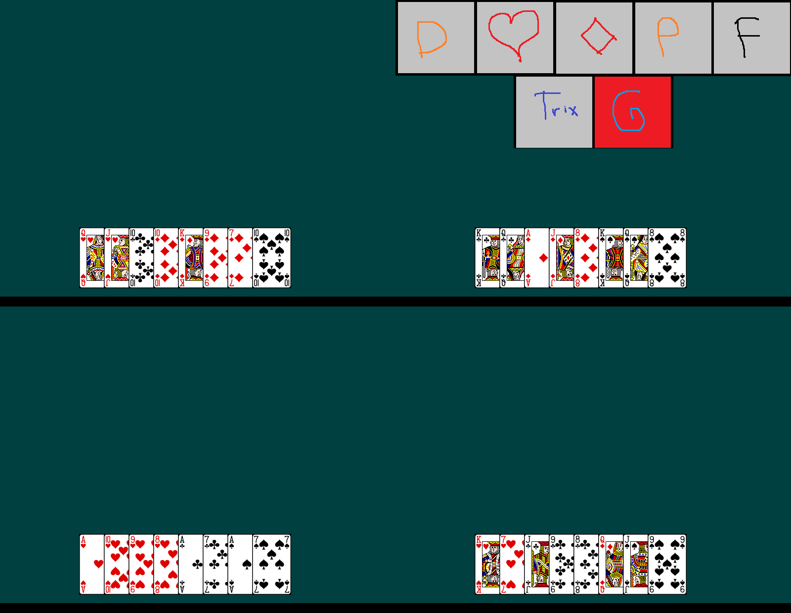

# Client baseline: how the old SDL client behaves

**For:** Seif, who will edit this list into the behaviour spec for the new web client.
**How it was made (2026-09-23):** 4 bots played one full `dineri` contract on the old C++ server and 4 old SDL clients (`archive/client-sdl`). The bots drag cards with the mouse like a person, inside a nested X display. Every item below was either seen in the screenshots or read in the client code (`archive/client-sdl/src/graphics.h`), and each says which. To reproduce: `archive/client-sdl/tools/bot_driver.py`.

**How to edit:** each section has a **Seif: wanted** line. Write what you want there, and mark items `keep`, `change: …` or `drop`. Anything already decided in `RULES.md` is listed under *Already decided* so you don't have to repeat it.

Each screenshot shows all 4 players' windows at the same moment:
top-left **lam3i** (seat 0) · top-right **bochra** (seat 1) · bottom-left **ldhaw** (seat 2) · bottom-right **klafez** (seat 3).

---

## 1. Window and table
- **B-1** A fixed 800×600 window. Its title is your name, and the name is the only place it appears. *(seen)*
- **B-2** A plain dark teal background. The table is a thin white rectangle in the middle. *(seen)*
- **B-3** No other players' names anywhere, and no scores, round number, or indication of which contract number this is. *(seen)*
- **B-4** No sound and no animation. A card follows the mouse while you drag it; everything else jumps into place. *(code)*

**Seif: wanted —**

## 2. Picking a contract

- **B-5** The picker sees 7 hand-drawn tiles across the top: D (damet), ♥ (ray), ♦ (dineri), P (pli), F (farcha), Trix, G (general), with their own hand below. They click a tile to pick. *(seen)*
- **B-6** A contract the picker already used is covered with a grey "nope" square. This is tracked only on that player's own computer. *(code)*
- **B-7** The other 3 players see only their own hand on an empty table: no opponents' cards, and nothing saying who is picking or that a pick is happening. *(seen)*
- **B-8** The client doesn't check the "trix needs a jack" rule. *(code)*

**Seif: wanted —**

## 3. Your hand and playing a card

- **B-9** Your 8 cards sit in one overlapping row at the bottom, sorted by suit (♥ ♣ ♦ ♠) and high to low within a suit. *(seen)*
- **B-10** You play by **dragging** a card onto the table rectangle. There's no click-to-play. *(code, and how the bots play)*
- **B-11** If you drop outside the table, out of turn, or without following suit, the card silently snaps back. Nothing explains why. *(code)*
- **B-12** Illegal cards look the same as legal ones: nothing is greyed out. *(seen)*
- **B-13** A played card leaves a **gap** in your row, and the other cards don't close up. *(seen, screenshot 5)*
- **B-14** Whose turn it is: a small grey square next to that player's side of the table (just above your hand when it's you). It's easy to miss. *(seen)*

**Seif: wanted —**

## 4. The table during a trick

- **B-15** Each played card appears on the table on the side of whoever played it: yours at the bottom, the next player's (counter-clockwise) on the right, the player opposite at the top, the previous player's on the left. *(seen)*
- **B-16** The cards overlap each other a lot, which makes the trick hard to read (screenshot 3). *(seen)*
- **B-17** The chosen contract is shown as its small tile in the table's top-right corner. There's no ×2 or ×4 indicator and no picker shown. *(seen)*
- **B-18** The 4th card stays visible for about half a second, then the whole trick disappears at once. There's no "who won the trick" indication. *(seen, server timing)*

**Seif: wanted —**

## 5. Opponents
- **B-19** Each opponent is a fan of card backs: across the top for the player opposite, and in columns on the left and right. The backs are the GNOME/Aisleriot foot logo. *(seen)*
- **B-20** **Bug:** the opponent fans don't show the real number of cards. When you play a card, a back disappears from each fan at the same position as your card, and it reappears at the end of the trick. Opponents always seem to hold 8 (screenshots 3 and 5). *(seen + code: `cards_array`)*

**Seif: wanted —**

## 6. After a trick

- **B-21** The previous trick is shown as 4 small cards in the table's bottom-right corner, always visible, and replaced when the next trick ends. It doesn't say who played which card or who won. *(seen)*
- **B-22** Tricks you won aren't shown anywhere: no pile, no count. *(seen)*

**Seif: wanted —**

## 7. End of a contract and of the game

- **B-23** When the 8th trick ends, the next hand is dealt straight away and the next picker is asked. There's no score screen or summary, and nobody sees who took what. *(seen)*
- **B-24** Scores exist only in the server's terminal. Players never see them. *(seen: server printed lam3i 40, bochra 0, ldhaw 0, klafez 40)*
- **B-25** The old server rotates the picker to the next seat; bochra picks second. *(seen)*
- **B-26** There's no game-over screen. When the server stops, the window closes. *(code)*

**Seif: wanted —**

## 8. Leaving, errors, connection
- **B-27** The server address is hardcoded to this computer (`127.0.0.1:8080`). *(code)*
- **B-28** If any player's window closes, every other client crashes (seen in the first smoke test). *(seen earlier)*

**Seif: wanted —**

---

## Already decided (RULES.md), so the new client must do these
- **Joining** (R-TABLE-1 to 3): an invite link, then pick a name and take a seat. The game starts automatically when the 4th player sits.
- **Room owner powers** (R-TABLE-4 to 7): a pause on disconnect, with the owner's options (wait for a replacement, resume with the bot, end the game), kick and leave with a new link, and returning to your seat.
- **Last trick** (R-TRICK-6): face down, and each player can look at it **twice per contract**. This replaces B-21, where it's always visible.
- **Won tricks** (R-TRICK-6): each player's trick **count** is visible, but not the cards (compare B-22).
- **Result screen** (R-GAME-10): the loser front and centre, the winner second.
- **Play again** (R-TABLE-8): each player clicks Ready, and the next game starts when all 4 are ready.
- **Language** (R-TABLE-9): English. The contracts keep their names: `dineri`, `damet`, `pli`, `farcha`, `ray`, `general`, `trix`.
- **Rules the old client doesn't cover**: the K♥ declaration in ray and general (R-RAY-3), the whole trix table (4 stacks, passes, the extra turn after an ace), and the ×2/×4 multipliers.

## Still open
- **Between contracts:** does the next deal come automatically after a few seconds on a score summary, or does it wait until all 4 click Continue?
